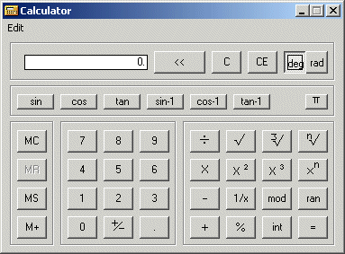



## Bobo Calculator

### Description

A scientific calculator. Written as Usercontrol, very lightweight, very easy to call. Demonstrates trigonometrical and logarithmic functions, each with just a line or 2 of code. Great to learn from.
 
### More Info
 

             |
---                |---
**Submitted On**   |2002-04-06 09:23:10
**By**             |[MrBobo](https://github.com/Planet-Source-Code/PSCIndex/blob/master/ByAuthor/mrbobo.md)
**Level**          |Beginner
**User Rating**    |4.9 (44 globes from 9 users)
**Compatibility**  |VB 6\.0
**Category**       |[Math/ Dates](https://github.com/Planet-Source-Code/PSCIndex/blob/master/ByCategory/math-dates__1-37.md)
**World**          |[Visual Basic](https://github.com/Planet-Source-Code/PSCIndex/blob/master/ByWorld/visual-basic.md)
**Archive File**   |[Bobo\_Calcu69203452002\.zip](https://github.com/Planet-Source-Code/mrbobo-bobo-calculator__1-33426/archive/master.zip)

